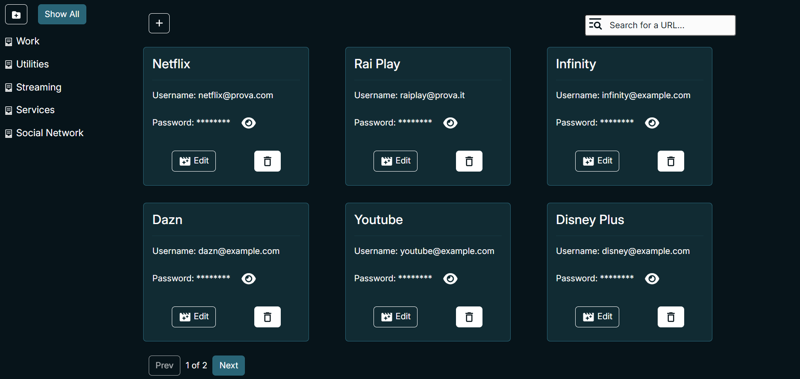

GuardianPass

GuardianPass è un'applicazione web per la gestione sicura ed organizzata delle password personali, con meccanismi di criptazione e token di autenticazione. Gli utenti possono aggiungere, consultare, modificare ed eliminare password, organizzarle in cartelle per facilitare la gestione e la ricerca. 

Per lo sviluppo, sono state utilizzate tecnologie come Java (21 JDK) per la gestione del server, React JS per il frontend e PostgreSQL come database per il salvataggio dei dati.

